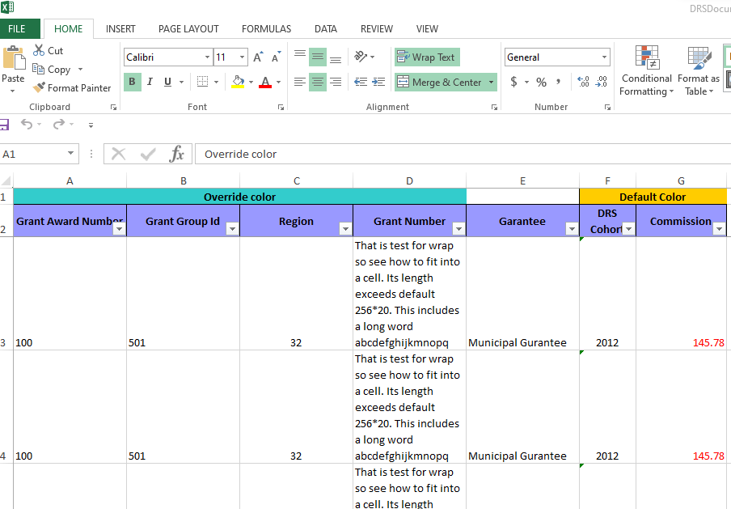
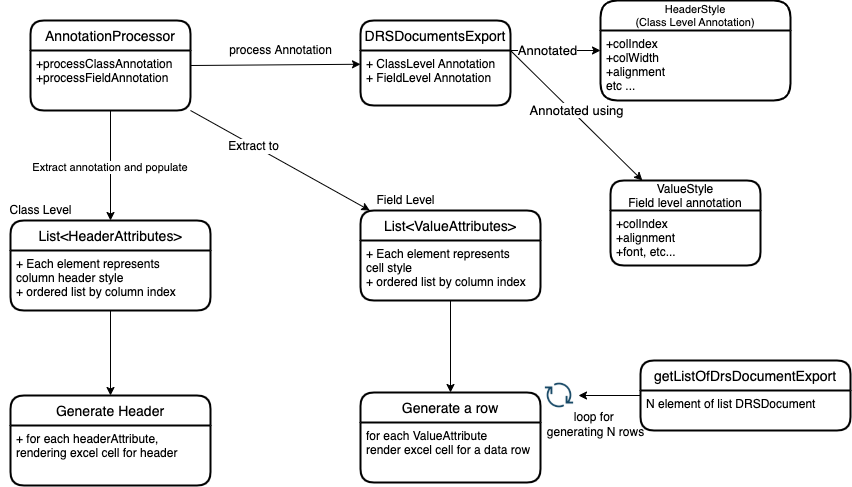
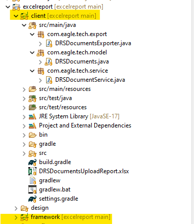

# Excel Report Framework

This framework presents a clever method for generating Excel reports. In the traditional approach, it writes styles and values directly into the Excel sheet, reminiscent of the Java servlet approach used before the introduction of JSP. In that earlier method, servlets were employed to output HTML. For more details, please consult the code in [DrsCorrespondenceExportGenerator.java](legacy/DrsCorrespondenceExportGenerator.java). In the conventional method, developers had to write hundreds or even thousands of lines of code for each Excel report, lacking consistency. 

### 1. Requirements
During my tenure at Eagle Tech Company, clients frequently requested various new types of Excel reports each month. Recognizing the time-consuming nature and lack of consistency in the existing approach, I developed the Excel Report Framework. This framework can efficiently generate a standardized (tabular) Excel file based on a list of input objects. The generated Excel file, as depicted in the screenshot below, supports features such as merged cells in the Excel sheet. This framework streamlined the process of creating diverse Excel reports, enhancing both efficiency and consistency in report generation. This [Excel Report Generation.doc](design/Excel+Report+Generation.doc) documents the initial requirement and design.

*Figure 1: Screenshot of a generated Excel test file

### 2. Design
The framework employs Java annotations and Reflection for its solution. The annotations serve as attributes to capture information such as style, header name, column sequence, etc. There are two types of annotations: class-level annotation [HeaderStyle.java](framework/src/main/java/com/eagle/tech/annotation/HeaderStyle.java), which describe Excel column names and merge styles, and field-level annotation [ValueStyle.java](framework/src/main/java/com/eagle/tech/annotation/ValueStyle.java), which define value styles (such as the right alignment of numeric values in a cell, font information). [AnnotationProcessor.java](framework/src/main/java/com/eagle/tech/reflection/AnnotationProcessor.java) is for extract Header and Value Annotation of a Class. 

Reflection is utilized to obtain the values bound to the fields and populate excel cells.  The class diagram as follow.

*Figure 2: Class Diagram for Excel Report Generation Framework.

The project consists of two subprojects. The first is the framework, which is built into a JAR file and then posted to an artifact repository. The second project is the client, mimicking an application that utilizes the aforementioned framework.

 

The client-side application comprises three classes. The first is [DRSDocuments.java](client/src/main/java/com/eagle/tech/model/DRSDocuments.java), which is an annotated class representing a specific Excel report that needs to be generated. The second class, [DRSDocumentsExporter.java](client/src/main/java/com/eagle/tech/export/DRSDocumentsExporter.java), serves as the entry point to specify the type of Excel report and its file name. Finally, [DRSDocumentService.java](client/src/main/java/com/eagle/tech/service/DRSDocumentService.java) simulates loading data in the service tier.

### 3. Build

navigate under the project excelreport root and run

`./gradlew clean build`

The generated excel file named [DRSDocumentsUploadReport.xlsx](client\DRSDocumentsUploadReport.xlsx) is located under subproject <i>client</i> folder.

